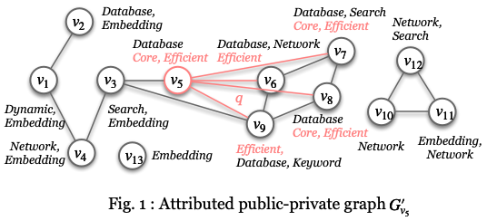

# PP-FP search algorithm
**Introduction**

This repository provides the implementation of the PP-FP community search algorithm proposed in our paper. The provided code can be compiled with g++. Ensure all input files are correctly placed in the working directory before execution. The dataset provided is the example shown in the following Fig. 1.
<p align="center">
  
</p>


**Experimental Setup (Reproducibility)**

All experiments were conducted on a machine equipped with:

- CPU: Dual AMD EPYC 7742 processors (2 × 64 cores, 2.25GHz)
- Memory: 2 TB RAM
- Programming language: C++ (C++17)
- Compiler: g++

Unless otherwise specified, the community coreness parameter is set to k = 3 in all experiments.
This setup is consistent with the experimental description in Section VII of the paper.

**Input:**

**1.	public_graph.txt**
- Each line is two authors which stands for a co-author relationship in the public graph. (#author_1_id# #author_2_id#)
- Sample:
```html
#1# #2#
#1# #4#
```
**2.	public_attribute.txt**
- Each line is an author with his/her author research interests in the public graph. (#author_name# #author_id# #research_interest#)
- Sample:
```html
#xxx# #1# #Dynamic;Embedding;#
#xxx# #2# #Database;Embedding;#
```
**3.	test_private.txt**
- Represents a private graph associated with a query author q.

  (1) The first line contains two elements. (#query_id# #n#)

  (2) The next n lines represent (n-1) edges in the private graph, each connecting an author id to the query id, along with the private attributes of the query node itself. (#author_name# #author_id# #author_private_interests) 
- Sample:
```html
5 5
#xxx# #5# #Core;Efficient;#
#xxx# #6# #Efficient;#
#xxx# #7# #Core;Efficient;#
#xxx# #8# #Core;Efficient;#
#xxx# #9# #Efficient;#
```
**4.	tree_index.txt**
- Stores the coreness index of the public graph.
- Each line is a node set with coreness=k. (coreness, author_size, author_1, author_2, ...)
- Sample:
```html
k=0 size=1 nodes: 13
  k=1 size=4 nodes: 1 2 3 5
```
**5.	attr_tree_index.txt**
- Stores the attribute-based coreness index of the public graph.
- Each block corresponds to a k-core, listing the nodes in the k-core and the keywords associated with these nodes.
- The first line specifies the coreness value `k`, the number of nodes in the k-core, and the node IDs, and the following lines list attributes and the corresponding nodes containing each attribute.
- Sample:
```html
k=0 size=1 nodes: 13
keywords:
Embedding: 13
  k=1 size=5 nodes: 1 2 3 4 5
  keywords:
  Database: 2 5
  Embedding: 1 2 3 4
  Network: 4
  Search: 3
  Dynamic: 1
```
**6.	fp_tree_input_q.txt**
- Contains the PP-FP-tree index generated for a query author q.
- Sample: 
```html
5 (3, 3) {Core, Database, Efficient}
  7 (3, 3) {Core, Database, Efficient}
    8 (3, 3) {Core, Database, Efficient}
```
**Output:**

**1.	node_output.txt**
- Provides the following details: the query node, running time, the community size, the attribute size;
- Sample:
```html
query_node	  time (seconds)	          community_size	      attribute_size
5	           0.000317	                5	                    2

```
**2.	Output_fp_q.txt**
- Provides the following details:
  
   (1) List the authors in the k-core community related to the query author q;

   (2) The common attributes of the k-core community.
- Sample:
```html
Node ID: 9
Node ID: 8
Node ID: 7
Node ID: 5
Node ID: 6
Attributes:
Database Efficient 
```
